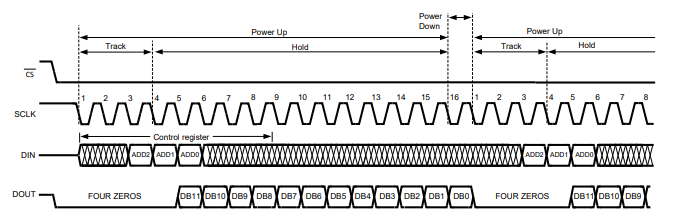
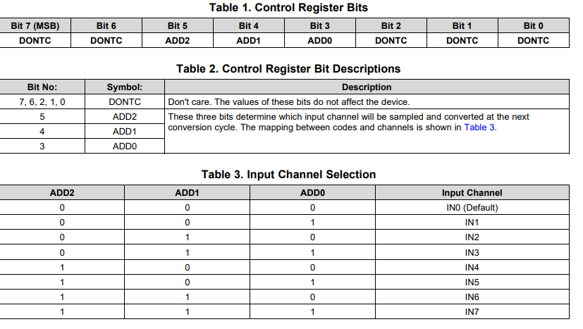
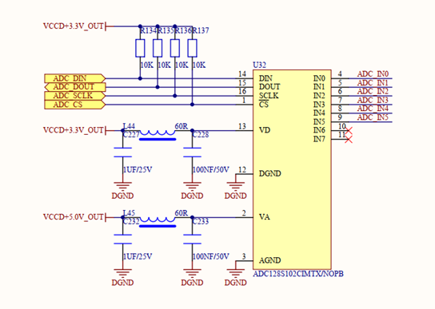
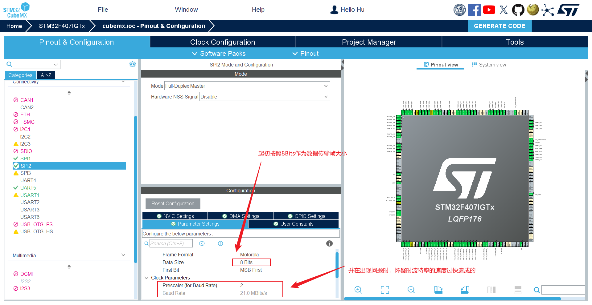
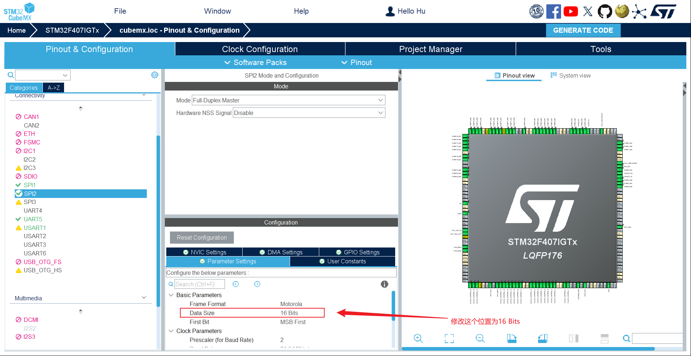

## <font size=3>一、ADC128s102硬件使用说明</font>
<font size=2>

```bash
create_at： 2025/10/30
aliases：   1.硬件：STM32F407IGT6
            2.平台：RT-Thread
```


该版本使用RTT的硬件SPI的方式编写ADC128S102的底层驱动代码。从数据手册看，DOUT数据前四位是0（芯片特性）后12位是采样数据，DIN在第六个时间点开始输入的ADC2,1,0指的是上位机要求的通道地址。所有数据都是上升沿采样下降沿输出。

我们写的是主机（MCU驱动器部分）所以DIN（对于ADC来说是输入，对于MCU来说是输出）在下降沿赋值，DOUT（对于ADC来说是输出，对于MCU来说是输入）所以在上升沿采样。





**ADC通道地址选择**


| 位序号（先出 MSB） | 含义       |
| ------------------ | ---------- |
| BIT7               | Don’t care |
| BIT6               | Don’t care |
| BIT5               | ADD2       |
| BIT4               | ADD1       |
| BIT3               | ADD0       |
| BIT2 … BIT0        | Don’t care |

如上表所示，ADC128S102的“有效通道地址”只占 BIT5~BIT3，其余 5 位随意。由于 ADC128S102 的“命令帧”是 16 位，数据手册里画的那 8 位只是 高字节（D15~D8），后面还有 低字节（D7~D0） 没画全，因此必须 连续送够 16 个 SCLK 上升沿 才能拿到 12 位转换结果。




**电路原理图参考**

| 芯片引脚 | MCU 引脚 | 功能                    |
| -------- | -------- | ----------------------- |
| CS       | PI0      | 片选                    |
| SCLK     | PI1      | 时钟                    |
| DOUT     | PI2      | 数据输出（接 MCU MISO） |
| DIN      | PI3      | 数据输入（接 MCU MOSI） |




</font>


## <font size=3>二、针对RTT配置以及硬件SPI配置的说明</font>

<font size=2>

ADC128S102是16bits作为一帧数据传输，起初我在配置CubeMX时，将 Data Size 配置为8Bits，然后使用连发两个字节数据进行通道数据帧的发送。在使用逻辑分析仪抓取数据时发现通道数据本来发送的是0x0800,实际抓取到的却是0x0100，与发送的原帧数据对不上。怀疑是波特率过快导致的数据帧丢失，在降低波特率后，测试结果依旧没变，便派出了波特率的影响。

```C
uint8_t tx_buf[2];
uint16_t cmd = (ch & 0x07) << 11;   /* 还是 0x0800 */
tx_buf[0] = cmd >> 8;               /* 先发高字节 0x08 */
tx_buf[1] = cmd;                    /* 再发低字节 0x00 */

struct rt_spi_message msg = {
    .send_buf   = tx_buf,
    .recv_buf   = &rx,
    .length     = 2,                /* 组两个数据发送出去，中间cs控制不拉高 */
    .cs_take    = 1,
    .cs_release = 1,
    .next       = RT_NULL
};

```




随后，受到模拟SPI的16bits数据读写启发，把CubeMX中SPI的 `Data Size`改为 `16Bits`,然后修改RTT的SPI配置代码的数据位宽为16,后进行测试，ADC128S102数据采集正常。

```C
rt_uint16_t tx = (ch & 0x07) << 11;   /* 命令帧 0x0800..0xE800 */
rt_uint16_t rx = 0;

struct rt_spi_message msg = {
    .send_buf   = &tx,
    .recv_buf   = &rx,
    .length     = 1,            /* 单位=字，1×16 bit */
    .cs_take    = 1,
    .cs_release = 1,
    .next       = RT_NULL
};
```



</font>
